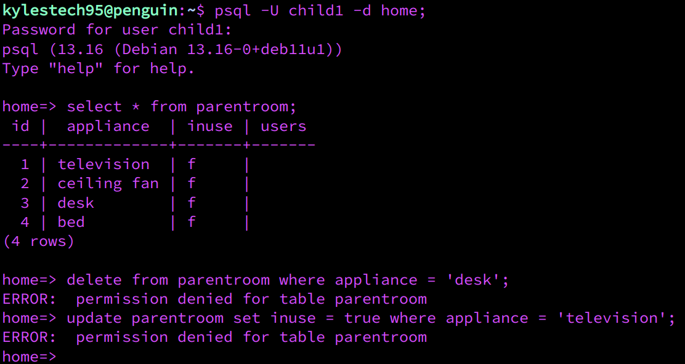

# Meet the RBAC Family


## Setup family - home [schema - database]
1. ```CREATE``` database (home)


2. ```\c``` (CONNECT) to home


3. ```CREATE SCHEMA``` family (schema)

4. ```CREATE SCHEMA``` affair (schem)

5. ```SHOW SEARCH_PATH```

6. ```ALTER DATABASE``` home ```SET SEARCH_PATH``` to family,public

7. Finally, ```CREATE``` a ```VIEW``` to view your role stats.
Access ```pg_roles``` table & filter roles that do not include "pg" (predefined roles) and "postgres ".

```CREATE VIEW current_roles AS SELECT * FROM pg_roles WHERE rolname not like 'pg%' AND rolname NOT LIKE 'postgres';```


**Tip:** <em>The ```SEARCH_PATH``` can be set **temporarily** by omitting ```ALTER DATABASE [database]``` in step number 6</em>

**Tip:** <em>Depending on the PostgreSQL version, after setting ```SEARCH_PATH```, if the path is not updated, it may be necessary to leave the current database (home) & ```\c``` to home again.</em>


## Creat Family roles & grant roles to family members

1. ```CREATE [role]```

**Tip:** <em>Logging in with a role is optional. Use ```CREATE [role] WITH LOGIN [PASSWORD 'password']```.</em>

2. ```CREATE [user] WITH LOGIN``` (Login is optional)


3. ```GRANT [rolname] to [role]```


4. ```\du``` (Display users & roles)


5. ```CREATE DATABASE [user] owner [user|role]```

**Tip:** <em>Grant ownership to a parent ROLE to both child databases.<br>Children are parents' property until they become 18 years old.</em>


## Grant & Revoke to roles|users
1. ```REVOKE from public``` & ```GRANT CONNECT```


2. ```\dn``` (show schemas) & ```GRANT USAGE to [role|user]```


3. ```GRANT ALL PRIVILEGES ON ALL TABLES IN SCHEMA family to [role|user]```


4. Grant priveleges to child role


5. Revoke priveleges from child role to parentroom


6. Alter default privileges on the current changes. New instances can inherit revoke/grant changes.


## Proof of Privileges

### Parent Privileges


### Child Privileges

1. Parent role privileges. SELECT,INSERT,UPDATE,DELETE


2. Child role privileges:
Children are granted ```ALL PRIVILEGES``` for the bathroom & childroom tables. 
Children are granted ```INSERT,UPDATE``` PRIVILEGES for the livingroom & kitchen tables.


### Children Revoked from Parents room

3. Children are revoked from having anything to do with thair parent's room (parentroom table)


## Parents pay off Mortgage
1. The current owner of home [database] is postgres (the bank or magistrate)

After paying off the mortgage in a short amount of time, you and your spouse are granted ownership of the property!

```ALTER DATABASE [db_name] OWNER TO [role|user]```


```\l```


2. All tables, views & sequences within the home database still belongs to the bank/magistrage


Since the mortgage is paid off, postgres will give ownership to parent role.

**One-By-One**

```ALTER TABLE [table_name] OWNER to [role|user]```

**Format queries and paste**
 ```
 SELECT 'ALTER TABLE '||tbl.tablename||' OWNER to parent'
FROM pg_tables tbl
WHERE tbl.schemaname = 'family';
```
**Tip:** <em>Do not forget to all the semi-colon -; at the end of queries</em>

3. After formatting is complete, copy & paste commands into terminal. (Ensure you are in the home database)


4. List the relations to view the changes ```\d```


5. It seems that 1 relation is currently owned by **postgres** <br> Here is the code to alter ownership


6. Below, we can view mom granting ```SELECT``` privileges on parentroom table to child role. Subsequently, the child role can view, or ```SELECT``` to parentroom, but cannot ```DELETE``` or ```UPDATE``` to the parentroom. The parent role owns the home database, and the relations within the database.




7. Don't forget to change schema ownership:


