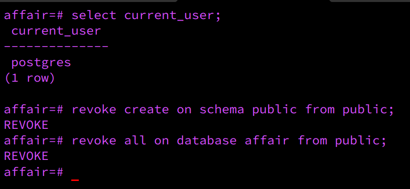

# Meet the RBAC Family


## Setup family - home [schema - database]
1. ```CREATE``` database (home)


2. ```\c``` (CONNECT) to home


3. ```CREATE SCHEMA``` family (schema)

4. ```CREATE SCHEMA``` affair (schem)

5. ```SHOW SEARCH_PATH```

6. ```ALTER DATABASE``` home ```SET SEARCH_PATH``` to family,public

7. Finally, ```CREATE``` a ```VIEW``` to view your role stats.
Access ```pg_roles``` table & filter roles that do not include "pg" (predefined roles) and "postgres ".

```CREATE VIEW current_roles AS SELECT * FROM pg_roles WHERE rolname not like 'pg%' AND rolname NOT LIKE 'postgres';```


c

**Tip:** <em>Depending on the PostgreSQL version, after setting ```SEARCH_PATH```, if the path is not updated, it may be necessary to leave the current database (home) & ```\c``` to home again.</em>


## Creat Family roles & grant roles to family members

1. ```CREATE [role]```

**Tip:** <em>Logging in with a role is optional. Use ```CREATE [role] WITH LOGIN [PASSWORD 'password']```.</em>

2. ```CREATE [user] WITH LOGIN``` (Login is optional)


3. ```GRANT [rolname] to [role]```


4. ```\du``` (Display users & roles)


5. ```CREATE DATABASE [user] owner [user|role]```

**Tip:** <em>Grant ownership to a parent ROLE to both child databases.<br>Children are parents' property until they become 18 years old.</em>


## Grant & Revoke to roles|users
1. ```REVOKE from public``` & ```GRANT CONNECT```


2. ```\dn``` (show schemas) & ```GRANT USAGE to [role|user]```


3. ```GRANT ALL PRIVILEGES ON ALL TABLES IN SCHEMA family to [role|user]```


4. Grant priveleges to child role


5. Revoke priveleges from child role to parentroom


6. Alter default privileges on the current changes. New instances can inherit revoke/grant changes.


## Proof of Privileges

### Parent Privileges


### Child Privileges

1. Parent role privileges. SELECT,INSERT,UPDATE,DELETE


2. Child role privileges:
Children are granted ```ALL PRIVILEGES``` for the bathroom & childroom tables. 
Children are granted ```INSERT,UPDATE``` PRIVILEGES for the livingroom & kitchen tables.


### Children Revoked from Parents room

3. Children are revoked from having anything to do with thair parent's room (parentroom table)


## Parents pay off Mortgage
1. The current owner of home [database] is postgres (the bank or magistrate)

After paying off the mortgage in a short amount of time, you and your spouse are granted ownership of the property!

```ALTER DATABASE [db_name] OWNER TO [role|user]```


```\l```


2. All tables, views & sequences within the home database still belongs to the bank/magistrage


Since the mortgage is paid off, postgres will give ownership to parent role.

**One-By-One**

```ALTER TABLE [table_name] OWNER to [role|user]```

**Format queries and paste**
 ```
 SELECT 'ALTER TABLE '||tbl.tablename||' OWNER to parent'
FROM pg_tables tbl
WHERE tbl.schemaname = 'family';
```
**Tip:** <em>Do not forget to add the semi-colon -; at the end of queries</em>

3. After formatting is complete, copy & paste commands into terminal. (Ensure you are in the home database)


4. List the relations to view the changes ```\d```


5. It seems that 1 relation is currently owned by **postgres** <br> Here is the code to alter ownership


6. Below, we can view mom granting ```SELECT``` privileges on parentroom table to child role. Subsequently, the child role can view, or ```SELECT``` to parentroom, but cannot ```DELETE``` or ```UPDATE``` to the parentroom. The parent role owns the home database, and the relations within the database.


7. Don't forget to change schema ownership:


## Meet the Mistress (New Role)

1. Dad creates mistress role.


**Tip:** <em>For this particular scenario, the mistress role will **not require a user** because this character can be more than 1 person acting as a ```mistress```, but this role is configured with a login password.</em>

**Tip:**<em>After giving the role parent ```CREATEDB CREATEROLE``` privileges, it seems that the dad (with parent privileges) is unable to create. To workaround this issue ```CREATEDB CREATEROLE``` has been set explicitely to dad and to mom</em>


In PostgreSQL, a role must be explicitly given the CREATEDB permission to create databases, unless it's a superuser role. Superuser roles bypass all permission checks.

### The mistress is a guest of Dad, so he grants/revokes their privileges under the affair schema.

**Dad created a bedroom under the affair schema**

**Tip:**<em>Feel free to include the affair schema into the ```SEARCH_PATH```, or else you will need to include your newly created table with ```affair.table_name```</em>

2. ```SHOW SEARCH_PATH``` & ```SET SEARCH_PATH``` (Temporary change)

**Tip:**<em>To change the search_path permanently within ```home``` database, ```ALTER DATABASE home SET SEARCH_PATH to family,affair,public```.<br> Dad can do this because dad is undera parent role, which is an ```OWNER``` of database ```home```</em>


3. Dad creates his own bedroom within the home under the affair schema. Then he inserts some appliances.


4. Dad grants/revokes the mistress to/from privileges


5. ```GRANT SELECT, UPDATE``` privileges to the mistress


6. Dad revokes kids and wife from having access to the affair schema.

**Tip:**<em>
Mom can grant herself usage to the affair (because mom is a ```parent``` and owns the same database as dad) but does truly believes her husband is loyal, therefore, this schema does not exist to mom...yet. Dad is **hiding** the affair schema from mom.
</em>


## Mom Catches Dad Cheating

1. Mom is on a coffee date with her best-friend, Charyll.
Charyll informs mom that she believes her husband [**dad**] may be suspect of cheating by inviting 1 woman to the house per week.

- Mom is shocked in disbelief. Mom leaves work early and speeds home due to intense paranoia, thinking her husband can be cheating on her at this very moment.

- Since Mom has is a co-owner of the ```house``` database, mom is going to grant herself usage onto the ```affair SCHEMA```.

- Mom can see that an ```affair SCHEMA``` exists, but she is limited to what she can see and/or do within this table.


- Mom attempts to grant herself access to see what is going on in the affair.bedroom table, but cannot because **Dad is the owner of the bedroom table, not Mom**.


**Tip:**<em>Mom is an owner of the ```house``` database, but not the ```bedroom``` table.</em>

2. Mom is aware what the word, **affair** means, so she knocks on the door loudly with attitude. Requesting her hudband to come out.

- After Dad opens the door, mom can see everything, even the "adult toys" appliance that is currently in use.


3. After confirming Charyll's suspicion, mom gives dad 2 choices: 

**a. Dad purchases another home for their affair schema and stays with family schema.**

1. ```create database [db_name]```


2. Dad requests from the bank/magistrate to revoke all public creations from public schema


3. Dad alters the ```SEARCH_PATH``` for ```affair DATABASE``` for a convenient search.


4. Dad grant access to mistress, but revokes to his own family from ```affair DATABASE```.

5. Create ```affair SCHEMA```
6. 

6. ```REVOKE``` child & parent roles from accessing affair scema within affair


7. Dad creates bedroom table in ```affair DATABASE```


8. Dad grants all privileges to mistress & revokes from his own family


9. Dad drops affair bedroom table & ```affair SCHEMA``` from home database


**b. Mom divorces dad by seizing (change ownership) his assets & divorcing (drop role) Dad.**


